# Galerly - Deployment Status

## ✅ **READY FOR DEPLOYMENT**

All AWS infrastructure has been set up in **eu-central-1** (Frankfurt, Germany).

---

## Infrastructure Summary

| Resource | Status | Details |
|----------|--------|---------|
| **S3 Buckets** | ✅ Ready | 3 buckets created, static hosting configured |
| **DynamoDB** | ✅ Ready | 36 tables with Point-in-Time Recovery |
| **Lambda** | ✅ Ready | galerly-api (Python 3.11) |
| **API Gateway** | ✅ Ready | k4z6imb03i (HTTP API) |
| **CloudFront** | 🟡 Deploying | EL9YJ5PLBROTL (15-20 min) |
| **IAM** | ✅ Ready | 3 users, roles, least-privilege policies |

---

## Quick Start

### 1. Check CloudFront Status

```bash
aws cloudfront get-distribution \
  --id EL9YJ5PLBROTL \
  --query 'Distribution.Status' \
  --output text
```

Wait until status shows: **`Deployed`** (currently: `InProgress`)

### 2. Trigger First Deployment

```bash
# When CloudFront is ready, trigger the workflow
gh workflow run ci-cd.yml

# Watch the deployment
gh run watch
```

### 3. Monitor Deployment

The CI/CD pipeline will:
1. ✅ Build (frontend + Lambda package)
2. ✅ Run unit tests
3. ✅ Deploy to production (S3 + Lambda)
4. ✅ Run integration tests
5. ✅ Run verification tests
6. ✅ Run smoke tests
7. 🔄 Auto-rollback if tests fail

---

## Access URLs

### Production Endpoints

| Service | URL |
|---------|-----|
| **Frontend** | https://dsiu3da7x6m88.cloudfront.net |
| **API** | https://k4z6imb03i.execute-api.eu-central-1.amazonaws.com |
| **Health Check** | https://k4z6imb03i.execute-api.eu-central-1.amazonaws.com/health |

### Test Endpoints

```bash
# Test Lambda directly
aws lambda invoke \
  --function-name galerly-api \
  --payload '{"httpMethod":"GET","path":"/health"}' \
  response.json && cat response.json

# Test API Gateway
curl https://k4z6imb03i.execute-api.eu-central-1.amazonaws.com/health

# Test CloudFront (once deployed)
curl https://dsiu3da7x6m88.cloudfront.net
```

---

## CI/CD Workflow Status

View the workflow diagram: [WORKFLOW_DIAGRAM.md](.github/WORKFLOW_DIAGRAM.md)

```mermaid
graph TD
    A[Push to main] --> B[Build]
    B --> C[Unit Tests]
    C --> D{Tests Pass?}
    D -->|Yes| E[Deploy Production]
    D -->|No| F[Fail]
    E --> G[Integration Tests]
    E --> H[Verification Tests]
    E --> I[Smoke Tests]
    G --> J{All Pass?}
    H --> J
    I --> J
    J -->|Yes| K[✅ Success]
    J -->|No| L[🔄 Rollback]
```



---

## GitHub Actions Variables

All configured and ready:

```bash
gh variable list | grep -E "API_|CLOUDFRONT|CDN|LAMBDA|AWS"
```

Current values:
- `AWS_REGION`: eu-central-1
- `AWS_ACCOUNT_ID`: 278584440715
- `API_GATEWAY_ID`: k4z6imb03i
- `API_BASE_URL`: https://k4z6imb03i.execute-api.eu-central-1.amazonaws.com
- `CLOUDFRONT_DISTRIBUTION_ID`: EL9YJ5PLBROTL
- `CDN_DOMAIN`: dsiu3da7x6m88.cloudfront.net
- `LAMBDA_FUNCTION_NAME`: galerly-api

---

## Cost Estimate

### AWS Monthly Costs (Low Traffic)

| Service | Cost | Notes |
|---------|------|-------|
| Lambda | $0-5 | 1M requests/month free |
| API Gateway | $0-3 | 1M requests/month free |
| S3 | $0.50-2 | Storage + requests |
| CloudFront | $1-5 | 1TB free/month (year 1) |
| DynamoDB | $0-5 | 25GB free + on-demand |
| **Total** | **$5-20/month** | For low-medium traffic |

### Free Tier Benefits

- Lambda: 1M requests + 400,000 GB-seconds/month
- API Gateway: 1M requests/month (12 months)
- CloudFront: 1TB data transfer/month (12 months)
- DynamoDB: 25GB storage + 25 read/write units

---

## Troubleshooting

### View Lambda Logs

```bash
aws logs tail /aws/lambda/galerly-api --follow --region eu-central-1
```

### Check Deployment Status

```bash
# CloudFront
aws cloudfront get-distribution --id EL9YJ5PLBROTL --query 'Distribution.Status'

# Lambda
aws lambda get-function --function-name galerly-api --query 'Configuration.State'

# API Gateway
aws apigatewayv2 get-api --api-id k4z6imb03i --query 'ApiEndpoint'
```

### Test Each Component

```bash
# S3
aws s3 ls s3://galerly-frontend/

# Lambda
aws lambda invoke --function-name galerly-api --payload '{}' /tmp/response.json

# API Gateway  
curl -v https://k4z6imb03i.execute-api.eu-central-1.amazonaws.com

# CloudFront
curl -I https://dsiu3da7x6m88.cloudfront.net
```

---

## Documentation

| Document | Description |
|----------|-------------|
| [AWS_INFRASTRUCTURE_COMPLETE.md](AWS_INFRASTRUCTURE_COMPLETE.md) | Full infrastructure details |
| [WORKFLOW_DIAGRAM.md](WORKFLOW_DIAGRAM.md) | CI/CD visual flow |
| [IAM_SETUP.md](IAM_SETUP.md) | IAM users and policies |
| [README.md](README.md) | General guide |

---

## Next Actions

### Immediate (Required)

1. ⏳ **Wait for CloudFront** - Check status every 5 minutes
   ```bash
   watch -n 300 "aws cloudfront get-distribution --id EL9YJ5PLBROTL --query 'Distribution.Status'"
   ```

2. ✅ **Trigger Deployment** - Once CloudFront shows "Deployed"
   ```bash
   gh workflow run ci-cd.yml
   gh run watch
   ```

### Post-Deployment (Optional)

3. 🌐 **Custom Domain** - Configure your domain
   - Update CloudFront alternate domain names (CNAMEs)
   - Request ACM certificate in us-east-1
   - Update DNS records

4. 📧 **Email Configuration** - Verify SES
   - Verify sender email in SES
   - Move out of SES sandbox
   - Configure DKIM/SPF

5. 💳 **Stripe Webhooks** - Configure production
   - Add webhook endpoint to Stripe dashboard
   - Test payment flows

---

## Support

Questions or issues? Check:
1. GitHub Actions logs: `gh run view --log-failed`
2. Lambda logs: `aws logs tail /aws/lambda/galerly-api --follow`
3. CloudFront status: `aws cloudfront get-distribution --id EL9YJ5PLBROTL`

---

**Last Updated:** December 14, 2025  
**Region:** eu-central-1 (Frankfurt, Germany)  
**Status:** ✅ Infrastructure Ready | 🟡 CloudFront Deploying | ⏳ Awaiting First Deployment
